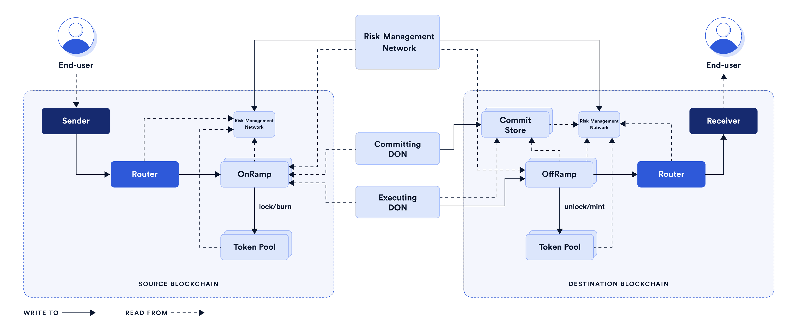

# Chainlink CCIP协议调研

CCIP，全称Cross-chain Interoperability Protocol，跨链互操作协议。

用途：使用CCIP跨链转移数据、代币。

## 架构

| Term                   | Description                                                                                             |
| ---------------------- | ------------------------------------------------------------------------------------------------------- |
| Sender                 | A smart contract or an EOA.                                                                             |
| Source Blockchain      | The blockchain the sender interacts with CCIP from.                                                     |
| Message                | Arbitrary data and/or tokens.                                                                           |
| Receiver               | A smart contract or an EOA. **Note**: An EOA cannot receive arbitrary data. It can only receive tokens. |
| Destination Blockchain | The blockchain the receiver resides on.                                                                 |

### 详细架构

用户只需要和Router交互，不需要理解完整的CCIP架构。

### 链上组成

#### Router

用户交互的主要合约。每条支持的链都有一个Router合约。

#### Commit Store

Committing DON与目标区块链上的CommitStore合约交互，从而存储源区块链上最终确定消息的Merkle根（the merkle root of the finalized messages on the source blockchain）。在Executing DON在目标区块链上执行之前，Merkle root必须得到Risk Management Network的验证（文档里写的是bless，这里理解成验证），每个lane（通道）只存在一个CommitStore。

#### OnRamp

一个lane有一个OnRamp合约，作用：

* 验证目标区块链特定的有效性，比如验证账户地址语法

* 验证message size limit（30KB）和gas limit（300，0000）

* 跟踪序列号以保留receiver的message序列

* 管理账单

* 和TokenPool交互（如果message包含token transfer）

* 发出（emit）一个由committing DON监控的事件（event）

#### OffRamp

一个lane有一个OffRamp合约，作用：

* 通过根据承诺且被验证（文档里写的是blessed）Merkle root验证Executing DON提交的proof，确保message的真实性

* 确保交易只被执行一次

* 经过上述的验证之后，OffRamp合约把接收到的message传递给Router合约，如果这笔CCIP交易包含token transfers，OffRamp合约调用TokenPool来将资产转移给receiver

#### Token Pool

ERC-20代币上的一层抽象合约，每种token有他自己的token pool，用来协助OnRamp和OffRamp执行代币相关的操作。token pools提供rate limiting，这是一个安全功能，使代币发行人可以设置最高速率，在该速度上可以将其token转移到每条lane上。

rate limit：包含两个值，capacity以及refill rate。capacity表示每笔交易转移的代币最大价值（以美元计）；refill rate包含token pool rate limit以及aggregate rate limit，token pool rate limit表示每个token pool设置的给定时间内能够转移的该代币价值，aggregate rate limit表示每个通道（lane）限制的给定时间内可以转移的所有代币价值，比如1个小时每条lane只能转移100万美元价值的代币，aggregate rate limit低于通道支持的所有token pool rate limit之和。

token pool主要在源链（source blockchain）上`lock`或`burn`以及在目标链（destination blockchain）上`unlock`或`mint`实现代币跨链转移。

比如：把ETH从一个链转移到另一条链，步骤如下。

1. 把ETH包装成WETH：用户和WETH合约交互或者使用DEX把他们的ETH转换为包装的ETH（WETH，Wrapped Ether）

2. 通过CCIP发送WETH

3. 把WETH解包装成ETH：同步骤1

#### Risk Management Network contract

维护允许bless或curse的Risk Management的节点地址列表。还包含在目标链上祝福承诺的Merkle root和CCIP的法定人数逻辑（quorum logic）。

大致为：当Risk Management node bless Merkle root时，Risk Management contract会为该节点添加bless权重，如果bless vote的权重总和超过bless阈值，Risk management contract认为该合约被祝福；相反，如果curse vote的权重总和超过curse阈值，contract认为该合约被诅咒，合约owner就必须解决原始合约可能存在的任何潜在问题，如果owner对这些问题已得到解决感到满意，他们可以代表Rsik management节点撤销诅咒。

可以联系Risk Management Network进行理解。

### 链下组成

#### Committing DON

DON：Decentralized oracle network

包含一些作业（jobs）来监控跨链交易：

* 每个作业监控源链上OnRamp合约的事件（events）

* 等待源链上交易的最终确定（finality）

* 捆绑交易并创建Merkle根，该根由Committing DON的一部分预言机节点进行签名

* 把Merkle根写到CommitStore合约中

#### Executing DON

包含一些作业来执行跨链交易：

* 同上面第一条

* 检查交易是否是CommitStore合约中中继Merkle根的一部分

* 等待Risk Management Network祝福（bless）这条message

* 创建一个该交易的Merkle证明，由OffRamp合约根据CommitStore合约中的Merkle根进行验证。这些检查通过后，作业将调用OffRamp合约来完成目标链上的CCIP交易

将承诺和执行分开允许风险管理网络在执行消息前有足够的时间检查消息的承诺，也允许进行额外的检查，比如异常重组深度、潜在模拟和削减。

#### Risk Management Network

风险管理网络是一组独立节点，用来监控并验证Committing DON提交到Commit Store的Merkle根。

验证成功后，节点调用风险管理合约"祝福（bless）"Merkle根。收到足够的blessing vote，Merkle根就可以用于执行了。

如果出现异常，风险管理节点调用风险管理合约来“诅咒（curse）”系统。如果达到诅咒得法定人数，风险管理合约就会暂停，以防止任何CCIP交易被执行。

## 计费

`fee = blockchain fee + network fee`

更多详细信息：[CCIP Billing | Chainlink Documentation](https://docs.chain.link/ccip/billing#billing-mechanism)

