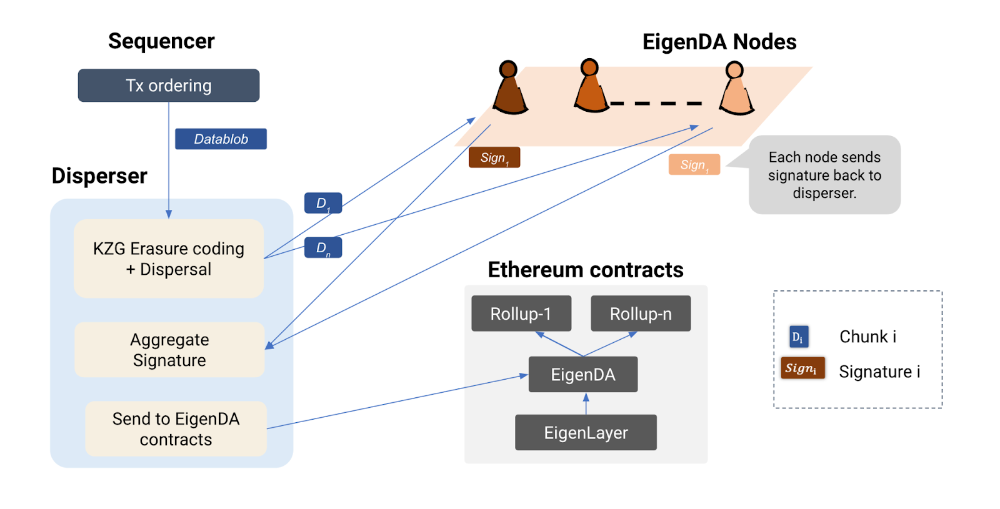
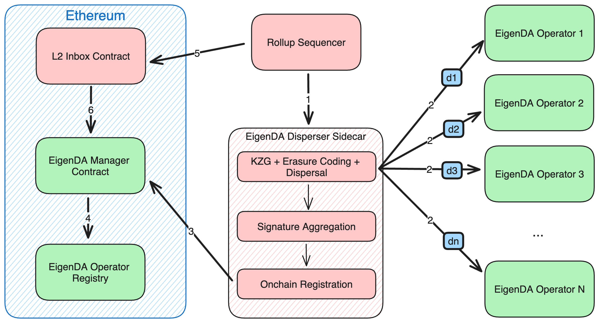

# EigenDA调研

EigenDA是由EigenLabs开发维护的建立在以太坊之上的数据可用性层。

## 架构

### 与Rollup的集成

### 组成部分

Operators - 存储交易数据

The Disperser - 接收Rollup的交易数据，对数据进行纠删编码并分割成chunks，生成数据kzg承诺和证明，发送给Operators

Retrieves - 向Operators查询chunks、验证chunks的正确性并为用户重建原始blob数据，由EigenDA托管

### 操作步骤

1. rollup Sequencer 创建一个包含事务的块，并向EigenDA的Disperser发送请求以分散数据 blob

2. Disperser 负责将数据块纠删编码分割成chunks，生成 KZG 承诺和 KZG multi-reveal proof，并将承诺、chunks和证明发送到 EigenDA 网络的Operators

3. EigenDA 节点使用kzg multi-reveal proof根据 KZG 承诺验证接收到的数据块，保存数据，然后生成签名并将其返回给 Disperser 进行聚合

4. Disperser聚合收到的签名后，通过将聚合的签名和 blob 元数据发送到 EigenDA Manager 合约来在链上注册 blob

5. EigenDA Manager 合约在 EigenDA 注册表合约的帮助下验证聚合签名，从而确认交易数据已经存储在Operators节点上

以上操作步骤就是EigenDA的数据可用性保障设计。存储交易数据的Operators节点，在EigenLayer上进行质押，从而保障这些节点的可信任。通过往链上提交签名，从而确认数据已经发送到Operators节点上。EigenDA保存交易数据，直到其交易状态在Rollup Bridge上最终确定。
