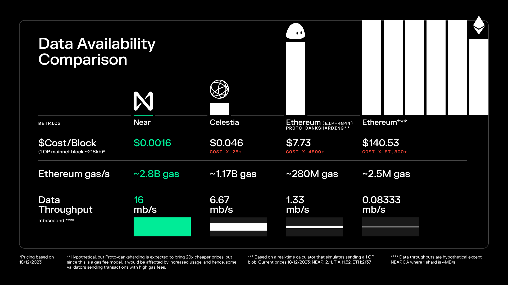

# NearDA调研

Near DA的目的：使用NEAR作为Rollup堆栈中的数据可用性（DA）层，简化Rollup网络并降低成本。

亮点：成本低。NEAR DA宣称其比在以太坊上发布blob要便宜大约85000倍，比在Celestia上发布blob便宜30倍。

## 架构

Near DA接收Rollup提交的交易数据，将其存储在自己Near链上。Near DA利用NEAR共识机制，即Nightshade，将网络并行化多个分片（本质上是多个并行区块链），NEAR上的每个分片都会生成块的一小部分，称为chunk，这些chunk被聚合从而产生块。

NEAR DA拥有组件：

blob 存储合约：部署在NEAR区块链上的合约，可以存储Rollup提交的交易数据

轻客户端：访问交易数据

RPC客户端：将Rollup提交的交易数据发布到NEAR

没有持续性证明、链上验证。

## 数据有效期

NearDA的数据有效期大约为60小时，约为5个NEAR epochs，之后，数据将被修剪，归档节点负责维持交易数据。
