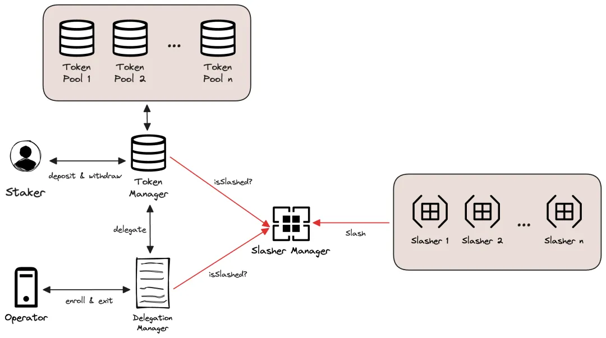

# EigenLayer调研

## 目的

简化基础架构搭建。

1. 构建一个平台连接质押者和基础架构开发人员

2. 允许质押者使用任何代币提供经济安全性

3. 使质押者能够重新质押他们的质押，并在为其他基础架构提供安全性的同时赚取原生 ETH 奖励

4. 通过重新质押来池化安全性，而不是使其分散化

> 什么是流动性质押代币（LST）？
> 
> 质押通常涉及锁定一定数量的代币以支持网络的运作，这可能包括验证交易或支持像权益证明这样的共识机制。一旦代币被质押，它们通常会变得不流动，意味着不能轻易地访问或出售。这时，LST的作用就显现出来了。
> 
> 流动性质押代币是质押资产的代币化表示。用户在质押他们的资产时，会收到等量的流动性质押代币。这些LST随后可以被交易、出售或在其他DeFi协议中使用，即使原始资产仍在质押，也为质押者提供了流动性。

## 架构

**TokenManager**：处理质押者的质押和提取，充当所有代币的记账中心；在`TokenManager`下，每种代币都有一个`TokenPool`，每个`TokenPool`持有其自己对应的代币。

**Delegation Manager**：允许操作员注册和跟踪操作员份额；操作员注册加入某个Slasher，就代表他注册加入Slasher对应的AVS；记录质押者和运营者之间的委托关系；每个`TokenPool`中运营者持有的份额，跟踪每个运营者的解绑期（过了解绑期才能提取，queueWithdrawal->completeWithdrawal）；跟踪和加入AVS。

**Slasher Manager**：维护每个操作员的状态，跟踪每个AVS当前时间被削减的运营者；

**staker**：质押者可以为各种AVS质押代币；一些质押者可能不想亲自处理确保AVS运行安全性的运营，因此引入`operator`这一角色，质押者的代币余额可以委托给代表他们的operator。

**operator**：运行软件以确保每个AVS运行安全性的个人。如果运营者违反AVS承诺，质押者的代币将被消减。

**AVS**：基础设施服务，被称为主动验证服务（Activately Validated Services），为终端产品（可以直接面向普通用户）提供服务。注册到AVS就是赋予`slasher`消减你的质押的能力；AVS开发各种Slasher合约，指定消减质押的规则；AVS开发者可以利用共享的安全池来保护各种类型的新基础设施应用程序。

**Slasher**：单独的Slasher处理每个AVS的slash逻辑，是特定于AVS的，很可能由AVS开发人员开发。
