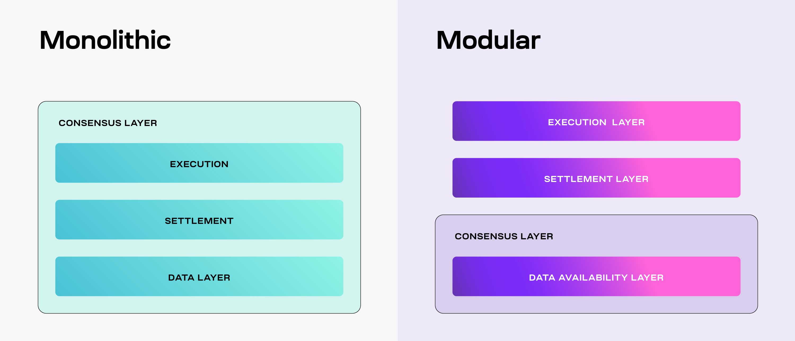
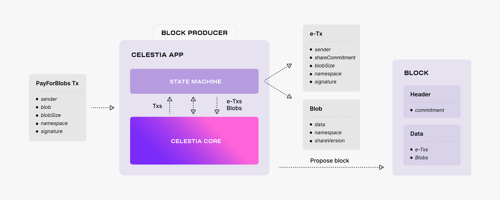

# Celestia调研

官网： https://celestia.org/

白皮书： https://arxiv.org/abs/1905.09274

## 白皮书内容

第一个模块化区块链网络。celestia就是把执行、共识和数据可用性拆开，把txs保存到单独的链下或者链上。区块链验证只需要验证交易数据的可用性，不需要执行和验证交易，区块链只需要做到排序交易（ordering）和保持交易记录（保证数据可用性）。

困扰去中心化区块链的可扩展性问题可归因于这样一个事实，即为了运行验证区块链的节点，节点必须下载、处理和验证链中包含的每笔交易。因此，出现了各种可扩展性工作。

全节点（也称为“完全验证节点”）是下载块头和交易列表的节点，根据一些交易有效性规则验证所有交易是否有效。这对于了解共识算法已接受哪些块是必要的。

“轻”客户端只下载块头，并根据交易有效性规则假设交易列表有效。最终可能会出现他们接受包含无效交易的、全节点已拒绝的区块的情况。

“数据可用性问题”询问客户端（例如轻客户端）在仅下载区块头，而不下载相应的区块数据（例如，交易列表）的情况下，如何满足自己的区块数据没有被区块的生产者（例如矿工）扣留，并且网络确实可以使用完整的数据。巴萨姆等人[9] 提出了一种基于纠删码和随机采样的解决方案。**为了让客户端确保区块数据可用，区块头包含对数据纠删码版本的默克尔树根的承诺**。为了防止客户需要下载整个区块数据（这会破坏数据可用性证明比自己下载整个数据更有效的目标），使用了二维纠删码，这将这些欺诈证明限制在特定轴上：只需下载一行或一列即可证明纠删码计算不正确，因此对于具有 n 个份额的块，欺诈证明的大小约为 O( √ n)（没有 Merkle 证明）。

通过将区块验证简化为数据可用性验证，区块链具有与点对点文件共享网络更相似的可扩展性，其中向网络添加更多节点会增加网络的存储容量。

Celestia仅使用一种机制来保证链上消息的可用性，交易由终端用户解释和执行。通过将区块验证简化为数据可用性验证，可以在亚线性时间内验证区块。使用应用程序状态主权的概念，已经证明多个主权应用程序可以使用同一链来实现数据可用性，而对彼此用户的工作负载的影响有限。

总结：Celestia提出了 LazyLedger，这是一种独特的区块链设计范例。LazyLedger 研究了理想的新区块链在系统中用作基础层的样子，其中基础层仅用于发布消息和数据可用性。其中基础层仅使用一种机制来保证链上消息的可用性，**交易由最终用户解释和执行**。**我们已经证明，通过将区块验证减少为数据可用性验证，可以在亚线性时间内验证区块**。此外，利用应用程序状态主权的概念，我们已经证明多个主权应用程序可以使用同一条链来实现数据可用性，而对彼此用户的工作负载的影响非常有限。

## Doc内容

Celestia通过将**交易执行与共识解耦**，并引入新的原始**数据可用性采样**来解决区块链的扩展问题。

前者要求Celestia只负责排序交易并保证其数据可用性；

后者为数据可用性问题提供了有效的解决方案，只需资源有限的轻节点从每个块中采样少量随机块来验证数据可用性。

参与采样的轻节点越多，网络可以安全处理的数据量就会增加，从而使区块大小增加（不同于比特币和以太坊，区块的大小受到安全性和去中心化特性的限制，区块越大，运行全节点的成本越高，全节点越少，去中心化特性越不明显；区块越大，广播区块越慢，区块产生分叉的概率越大），而不会同样增加验证链的成本。

区块链中的节点都遵循相同的规则集（即事务的有序序列）从起点（即初始状态）到终点（即共同的最终状态）。此过程确保网络中的所有节点都同意区块链的最终状态，即使它们独立运行。

这样就意味着区块链需要以下4个功能：

* 执行：需要执行正确更新状态的事务。

* 结算：需要一个执行层验证证据、解决纠纷欺诈以及在其他执行层之间架起桥梁的环境。

* 共识：需要就交易顺序达成一致。

* 数据可用性（DA）：需要使交易数据可用。执行、结算、共识都需要DA。

传统区块链，在单个基础共识层中一起实现所有四种功能。因此，影响系统扩容。

模块化区块链的一个架构案例如下：

基础层由DA和共识层组成，因此被称为共识和DA层（或简称为DA层）。

Celestia是一个数据可用性（DA）层。

Celestia DA层的两个关键功能是[数据可用性采集](https://blog.celestia.org/celestia-mvp-release-data-availability-sampling-light-clients)（DAS）和[命名空间Merkle树](https://github.com/celestiaorg/nmt)（NMT）：DAS使轻节点能够稀疏下载整个块而验证数据可用性；NMT使Celestia上的执行层和结算层能够仅下载相关的交易。

> 轻节点可以随机多轮采样，从而验证数据可用性，而不需要下载整个区块。
> 
> 假设轻节点连接至少一个诚实的全节点，这样轻节点就可以收到错误纠删码块的欺诈证明。

这部分内容解答了什么是区块链的数据可用性以及相关的一些问题。

[Data availability FAQ | Celestia Docs](https://docs.celestia.org/learn/how-celestia-works/data-availability-faq)

在Ceslestia中，块需要做纠删码编码，从而有冗余数据来帮助数据可用性采样过程。然而，对块进行纠删码编码的节点可能会在这一过程中出现错误。因此，需要至少一个诚实的全节点，能够对错误的纠删码块进行欺诈证明，而生成欺诈证明，就需要完整的块数据。可能存在验证者只向轻节点而不是全节点提供数据的情况，因此，全节点需要能够从轻节点存储的数据部分重建完整块（块重构）。

Celestia的交易生命周期：

节点类型：

https://docs.celestia.org/nodes/overview

https://docs.celestia.org/nodes/light-node

分为数据可用性层节点和共识层节点。其中，数据可用性层节点：轻节点、全节点（准确叫 全存储节点）、桥接节点；共识层节点：验证器节点、完整节点。

每个验证器都需要运行一个协调器，但只需要一个实体来运行中继器就可以了。

[Blobstream Relayer | Celestia Docs](https://docs.celestia.org/nodes/blobstream-relayer)

目前来看，celestia只是将rollup发布到celestia的交易进行merkle证明，blobstream对merkle根进行签名，中继器把证明和签名发送到EVM链上（以太坊）的blobstream合约中，EVM上的Layer2合约可以通过blobstream合约获得数据可用性证明（也就是交易数据的merkle根的签名）。

### OP+Celestia

rollup sequencer（rollup 排序器）在Layer2中负责创建区块，之后将该数据写入celestia和以太坊。rollup全节点负责从celestia和以太坊读取该数据，并验证它是否遵循该rollup的协议规则。[Integrate with Blobstream client | Celestia Docs](https://docs.celestia.org/developers/blobstream-offchain)

rollup sequencer在`ProduceBlock`方法中实现区块生产的逻辑：rollup将区块中包含的txs信息（data）发给celestia（通过`sequencer.CelestiaLightNodeClient.SubmitBlockData(data)`），celestia会返回一个区块信息，称为`span`，该`span`具体表示该data在celestia中的具体位置（celestiaBlockHeight、start、len），sequencer将`span`信息和自定义的`namespace`信息包含进区块头，再对该区块头签名，将签名信息也放进区块头中，这样，data和header就构成了sequencer构建的block。

sequencer构建好了block之后，将会等待celestia的验证器节点集`validator set`对数据根的元组根做出承诺，然后由celestia的中继器节点将承诺`commitment`上传到blobstream合约中。合约更新后，op rollup的sequencer就可以将block header发送到以太坊（`sequencer.EthereumClient.SubmitHeader(s.Blocks[i].Header)`）。

celestia会支持回退。也就是当celestia出现一些问题，而无法提供DA保障时，rollup sequencer可以回退到使用`calldata`来保障DA（和当前情况一样，将交易作为calldata发送到以太坊进行存储）。

Arbitrum+Celestia： https://docs.celestia.org/developers/arbitrum-integration

Arbitrum Orbit提供用户定制链（吞吐量、隐私、gas代币和治理等）。

Optimism+Celestia： [Introduction to OP Stack integration | Celestia Docs](https://docs.celestia.org/developers/intro-to-op-stack)

## 其他

Celestia的优势：

1 将执行与共识解耦，执行节点可以自由地执行与其感兴趣的应用程序相关的事务，而不是默认情况下每个人都执行所有事务。不需要每个人都下载并执行每个交易；

> 大多数链都注重去中心化，因此它们希望其完整节点在消费者硬件上运行，然而当区块链的状态增加，运行完整节点的成本会变得更高，更多节点不堪重负，从而全节点数量减少，轻节点数量增加。这就是为什么链通过强制执行区块/gas大小限制来限制其状态增长的速度。

2 Celestia具有极高的可扩展性

3 将区块链分叉变得更加简单。在一级区块链领域，有争议的硬分叉通常被认为风险很大，因为分叉链最终会削弱其安全性。因此，人们常常不惜一切代价避免分叉，从而抑制实验。在区块链历史上，Celestia 首次为区块链带来了分叉的能力，而无需担心安全性稀释。这是因为所有分叉最终都将使用相同的 DA 层，而不会放弃Celestia 共识层的安全优势。