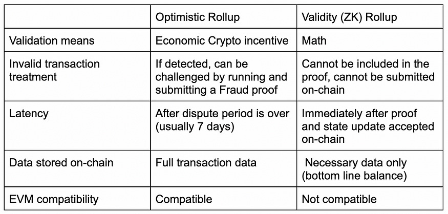
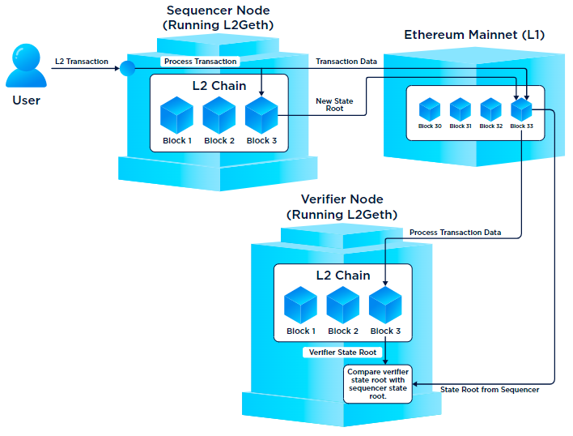
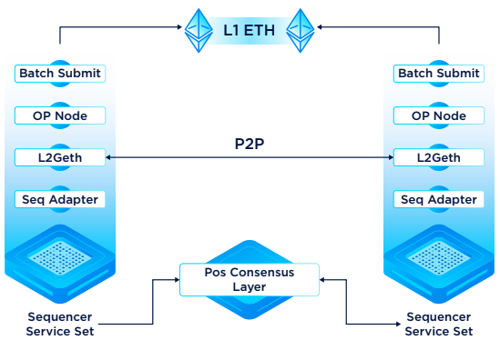
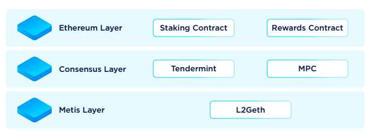

# Metis调研

---

Time: 2024.4.1

---

## Metis白皮书

### 链接

 https://drive.google.com/file/d/1-hGL4mj8hLtWV8jlt6zRz63yKY14cvyr/view

### 主要内容

**一句话总结** Metis是以太坊的L2扩展解决方案，提供更高效、可扩展的去中心化应用和交易平台。

**Metis主要特征**：

1 去中心化P2P网络

2 混合汇总发布（Hybrid Rollup）。减少withdrawal期，允许用户在几分钟内访问他们的资产而不是几天。

3 EVM等效

#### 第一部分

**第一部分**主要讲解了以太坊L1面临的扩展难题，从而引入L2，着重讲解了Rollup设计，分开介绍了Optimistic Rollups（ORs）以及Zero-Knowledge Rollups（ZKRs）。

**内容要点：**

* **Layer 2** 是一个广泛的、包罗万象的术语，用于描述构建在现有 L1 区块链之上的扩展解决方案。

* 与许多 L2 可扩展性解决方案一样，**Metis** 依赖于Rollup技术的创新潜力，提供有效且有竞争力的可扩展性服务。

* **Rollup** 在链外执行交易，并将它们与其他交易捆绑到一个区块中，然后将区块和证明传递给以太坊。然后执行的状态被发送到 L1 并由Rollup全节点在验证合约中确认。

* **乐观汇总（OR）**“乐观地”假设所有交易都是有效的，欺诈证明不会随每批交易一起发送，它们仅在实体想要对交易提出争议时使用。

* **零知识汇总（ZKR）** 与一般的汇总一样，主要功能是批处理大量的链下数据，将它们压缩成单个数据包，然后将数据和相关证明提交给以太坊的 L1。与乐观汇总不同，ZKR 为每批交易提供加密证据。每次将一批数据发送到以太坊主网时，都会附有一个“有效性证明”，该证明源自称为“SNARK”或“STARK”的加密方法。

* **ZKR缺点**：但是ZKR制作这些有效性证明的计算量很大。与相对简单的OR欺诈证明相比，它们可以被视为更加资源密集型。这引发了关于排序器是否需要运行专用硬件以有效操作节点的讨论，引发了对潜在集中化的担忧。

* **OR缺点**：OR需要7天的时间来确定交易的最终性。这样会影响用户从OR提现到以太坊（资金需要7天才能桥接）。

Metis打算在自己的 **混合汇总模型（Hybrid rollup model）** 中利用 OR 和 ZKR 的最佳方面。

图片来源：[Rollups: The Holy Grail of Ethereum Scaling | StarkWare](https://starkware.co/resource/rollups-the-holy-grail-of-ethereum-%20scaling/#:~:text=The%20use%20cases%20for%20rollups,significantly%20enhances%20the%20user%20experience.)

#### 第二部分

**第二部分**围绕Metis Hybrid Rollup进行介绍，分为Metis Hybrid Rollup设计、Metis Rollup中的实体、去中心化Sequencer Pool、Hybrid Rollup工作流程、Hybrid Rollup机制、Hybrid方法中一半的ZK、EVM和MVM几个主题。

##### Metis Hybrid Rollup设计

无缝兼容EVM、交易最终确定时间从7天减少到4小时、建Sequencer池而不是像其他Rollup一样仅依赖一个Sequencer。

##### Metis Rollup中的实体

sequencer、proposer、verifier。

**sequencer**(是核心)负责接收并处理用户交易、确定交易顺序、将交易追加到队列，它将交易捆绑到一个块中，并将其发布到共识和数据可用性层上，一个区块分为两部分：区块头和实际交易数据，除了其他数据之外，块头还包含对链状态的加密承诺，通常表示为 Merkle 根。大多数汇总实现目前只有一个由项目或基金会维护的 Sequencer，而Metis将会实现一个去中心化的Sequencer池。

**Proposer**需要质押保证金，从Sequencer中评估交易并随后将结果状态根记录在状态承诺链（SCC）中。

> SCC（State Commitment Chain）是用于存储状态根的链（是Optimism的核心组件之一）。主要目的是保持链上所有状态根的记录，这些状态根是通过按顺序执行Layer2上的交易计算得出的。SCC的状态根与Canonical Transaction Chain（CTC，规范交易链）中的交易一一对应。SCC主要功能：存储状态批次、删除状态批次、验证状态承诺、检查批次头是否存在欺诈证明窗口内。SCC是L1和L2之间通信的关键部分，它使得L1可以持续监控L2的状态变化，并在发现欺诈行为时执行欺诈证明，以保护链上的资产和用户。
> 
> OP的所有rolled-up块都存储在一个称为规范交易链的以太坊智能合约中。
> 
> OP 合约包括状态转换系统（STS）、欺诈证明者 (FP)、状态承诺链（SCC）以及规范交易链（CTC）。

**Verifier**评估每笔交易后的状态。

##### 去中心化Sequencer Pool

单一sequencer会使整个rollup面临潜在风险（集中化漏洞、审查制度、最大可提取价值（MEV）并发症）。Metis的sequencer pool作为一个集体单元来履行聚合、排序、执行交易的职责，该模型中的新节点需满足特点的先决条件，之后会被分配到特定的区块范围以用于事务提交，在批处理被认可和转发之前，超过三分之二的sequencers必须达成共识。sequencers在将交易批次转移到L1之前，使用多方计算（MPC, Multi-Party Computation）签名来验证交易批次，从而确保批内容的真实性。

sequencer pool中每个sequencer或节点由四个方面组成：

* L2 Geth：负责Metis层上的交易排序和区块组状

* Adapter Module：充当中介，促进与共识层上的其他外部模块交互，主要是POS节点

* batch submitter（Proposer）：将交易批次提交到L1。Proposer基于PoS进行轮换

* PoS节点：负责协调三个独立层。PoS节点在三层进行通信：以太坊、共识、Metis
  
  
  
  以太坊层确保网络内资产的安全锁定并奖励验证者，这些都被以太坊内的智能合约执行。
  
  共识层（PoS）由一组与以太坊主网并行的Tendermint PoS节点组成，从而提高效率，在开始共识时，这些节点首先寻找其他MPC地址/密钥，若不存在，则生成新密钥，这是因为，当sequencer提交一个L2 BatchTxs到L1，必须获得超过三分之二节点的签名才能使流程得到验证。
  
  Metis层处理block producer的选择，每个新纪元（指定时间段或一系列区块）都会根据共识层之前的操作选择一个新的区块生产者。
  
  

##### Hybrid Rollup 工作流程

1. sequencer生产块

2. proposer提交交易和状态

3. prover从L1读取数据以生成块和MIPS程序

4. 证明生成完成后，prover提交零知识证明（如果不提交，verifier将启动防欺诈流程，sequencer可能面临削减）

5. 证明一旦提交，合约就得到满足（如果不满足，verifier将启动防欺诈流程，sequencer可能面临削减）

6. 交易完成

##### hybrid rollup机制

* L1和L2智能合约：这个过程的核心是默克尔树，存储资金状态和交易数据的关键数据结构，使 L1 能够验证 L2 上的状态，而无需下载整个状态。本质上，用户在L2上进行交易，影响状态的变化，L2定期与L1共享状态的Merkle根以进行验证。

* L1组件：
  
  * Messaging：L1 的核心是消息传递组件，确保 L1 和 L2 之间的安全通信
  
  * Rollup 智能合约：L1 管理 L2 交易的组织和排序。该结构中的关键要素包括规范事务链（CTC，Canonical Transaction Chain，规定交易应用于L2状态的顺序的log）、状态承诺链（SCC，State Commitment Chain，包含一系列为来自CTC的每笔交易提议的状态根）、链存储容器（CSC，Chain Storage Container，优化gas使用，提供存储功能）
  
  * 验证：使用债券管理合约来监督ERC20代币的存款，奖励验证者、挑战任何不一致
  
  除了将 Merkle 根发布到 L1 之外，L2 还必须提供足够的 Merkle 树更改数据，以允许用户独立地重新创建 Merkle 树。

* L2组件：
  
  * Messaging：处理从L2到L1的消息
  
  * Predeploys and Standard Bridges：包含类似以太坊预编译的合约，前缀为0x42；L1标准桥和L2标准桥协同作用，促进ETH和ERC20的转换
  
  * Standard Token Factory：一个专门的合约，生成与L1相对应的标准L2 token，方便标准桥上的交互

##### Hybrid方法中一半的ZK

ZKFP（Zero Knowledge fraud-proof）不需要执行整个 rollup 的交易，而只需要提交一个单一的 ZK 证明来证明 rollup 的状态转换是有缺陷的。Metis 将 MIP （Microprocessor without Interlocked Pipeline Stages，没有互锁流水线级的微处理器）集成到其混合汇总设计中，称为zkMIPs（专为 ZK 证明定制的 MIP 修改版本），旨在优化证明者计算 ZK 证明。Optimism已经采用MIPS，Metis效防。

##### EVM和MVM

MVM 的设计与 EVM 几乎相同，但进行了关键改进，例如分离计算和存储功能。这些设计选择使得以太坊上的任何现有 dApp 都可以轻松地在 Metis 上构建，但与其他 OR 相比，还具有减少 Gas 费用和缩短提款等待时间的额外好处。

#### 第三部分

**第三部分**讲解Metis的经济学、治理和发展。

METIS 代币用于交易费，同时返还支付给网络上构建的协议的30% 的 Gas。

Metis 旨在通过社区主导的方法专注于改进去中心化自治组织 (DAO) 的概念。

## Metis官网内容

这一部分将主要了解Metis的数据可用层、经济模型以及如何参与Metis。

### 如何参与Metis

目前有三种模式可以参与Metis，依次为加入Metis社区生态治理（CEG，[CEG – Metis-Smart L2](https://www.metis.io/ceg)）、加入Metis的生态系统（[Building On Metis L2 | Metis Developer Documentation](https://docs.metis.io/dev)）以及申请成为Metis的Sequnencer（[Decentralized Sequencer - Metis-Smart L2](https://www.metis.io/decentralized-sequencer)）。

### 经济模型

Sequencer节点有机会通过区块生产和交易处理赚取METIS代币。

Proposer通过将规范交易链中的交易提交到状态承诺链中，获得奖励。

Verifier节点通过监控Proposer的无效/非法行为，从而获得奖励。

### Metis的数据可用层

目前，Metis将交易数据存放在Memolabs中，并且可以通过Peer Node访问这些数据。
