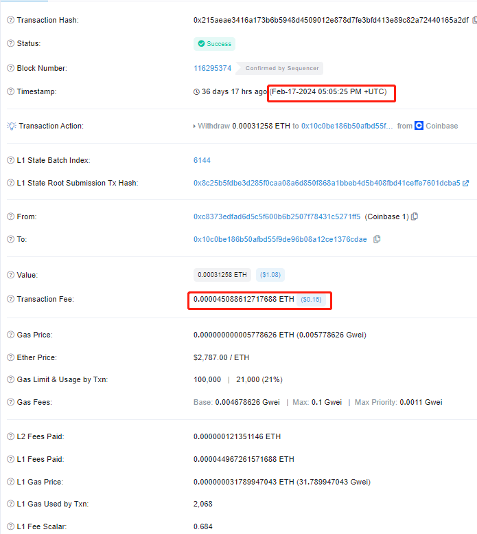
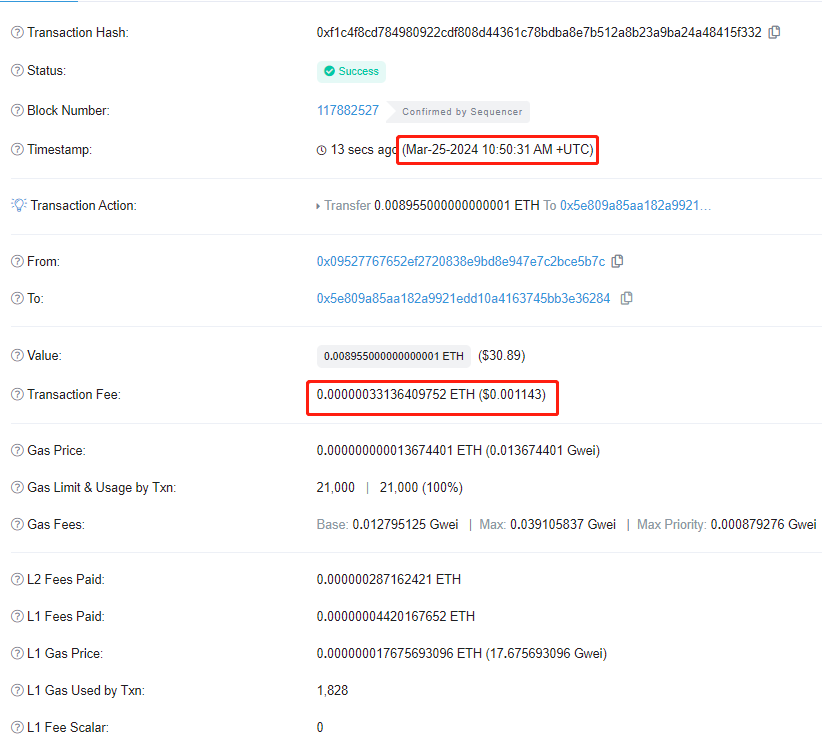

# 坎昆升级如何影响Layer2

2024年3月13日21时54分，以太坊坎昆升级（Cancun-Deneb，简称Dencun），经过在Goerli、Sepolia、Holesky测试网上为期将近2个月的测试后，终于在以太坊主网上正式激活，区块高度为19,426,587。

&nbsp;

坎昆升级包含对以太坊执行的一系列改进，旨在与Dened共识升级一起提高以太坊的可扩展性。这有助于降低以太坊Layer2 Rollups解决方案的交易成本。 

参考：[History and Forks of Ethereum | ethereum.org](https://ethereum.org/en/history/)

## EIP-4844

EIP-4844是坎昆升级的主要内容，也称为Proto-Danksharding，它引入了一种携带blob的新交易格式，blob中携带的数据无法被EVM执行访问，但是可以访问它的承诺值。携带blob交易格式的数据只是信标链（共识层）的一部分，由Layer1上所有共识节点完全下载，但在固定的时间段后会被自动删除（目前设置的是4096个epoch，大约18天）。

&nbsp;

目前一个以太坊L1区块最多可以携带6个"blob"，blob是4096个字段元素，每个字段元素32字节，每个"blob"支持最多128KB数据（0.125MB），计划在未来支持最多16个"blob"。

&nbsp;

> 从短期和中期来看，Rollup可能是以太坊唯一的无需信任的扩展解决方案。几个月来，L1的交易费用一直非常高。Rollups显著降低了许多以太坊用户的费用：Optimism和Arbitrum经常提供比以太坊基础层本身低约3-8倍的费用，而ZK Rollups具有更好的数据压缩并且可以避免包含签名，费用约比基础层低40-100倍。
> 
> 然而，即使这些费用对于许多用户来说也太昂贵了。解决Rollup本身长期不足的长期解决方案一直是数据分片（data sharding），这将为Rollups可以使用的链添加约16MB的专用数据空间。然而，数据分片仍需要相当长时间才能完成实施和部署。
> 
> EIP-4844通过实现在分片中使用的交易格式，但实际上并不对这些交易进行分片，从而提供了一个权益之计的解决方案。与完整数据分片相比，该EIP减少了可包含的交易数量上限，相当于每个区块约0.375MB的目标数据量（3个blob）和约0.75MB的限制数据量（6个blob）。
> 
> 引自：[EIPs/EIPS/eip-4844.md at master · ethereum/EIPs · GitHub](https://github.com/ethereum/EIPs/blob/master/EIPS/eip-4844.md)

&nbsp;

blob消耗的data_fee在交易执行前从发送方余额中扣除并销毁，即使交易失败也不予退还。

blob消耗的data_fee计算方式如下：

```sol
calc_data_fee = get_total_blob_gas(tx) * get_blob_base_fee(header)
// total_blob_gas = GAS_PER_BLOB * blob数量（1~6）
// 当前Gas_PER_BLOB值为2**17，也就是128*1024，相当于blob中一个字节消耗一个gas
get_total_blob_gas(tx) = GAS_PER_BLOB * len(tx.blob_versioned_hashes)
// 当前MIN_BLOB_BASE_FEE为1wei，BLOB_BASE_FEE_UPDATE_FRACTION为3338477
get_blob_base_fee(header) = fake_exponential(MIN_BLOB_BASE_FEE,header.excess_blob_gas,BLOB_BASE_FEE_UPDATE_FRACTION)
```

blob base fee计算规则与EIP-1559相似，根据网络中blob的供需决定。具体使用的是[指数型EIP-1559更新算法](https://dankradfeist.de/ethereum/2022/03/16/exponential-eip1559.html)，代码实现位于go-ethereum/consensus/misc/eip4844/eip4844.go/fakeExponential()。区块n的blob base fee由以下公式决定：

p^{data}n = m \cdot exp(\frac{E{n-1}}{s})

- m: MIN_BLOB_BASE_FEE

- E_{n-1}: 区块`n-1`为止累计的blob gas消耗超过目标的数量，也就是excess_blob_gas

- s: BLOB_BASE_FEE_UPDATE_FRACTION，即更新幅度因子，用于限制相邻区块base fee的变化幅度

&nbsp;

也就是说：当区块消耗的blob gas一直高于目标值（目前是3个blob），blob base fee会指数上涨，当区块消耗的blob gas一直低于目标值，blob base fee会指数下跌，直至`MIN_BLOB_BASE_FEE`。相邻区块的blob base fee变化率与EIP-1559中的base fee类似，都在12.5%以内。

## 对Layer 2 的影响

Layer 2(L2)是描述一组特定的以太坊扩展解决方案的统称。一个L2是一个扩展了以太坊并继承了以太坊安全保证的单独的区块链。引自：[Layer 2 | ethereum.org](https://ethereum.org/en/layer-2/)。

目前Layer 2解决方案主要包括Rollup（Optimistic Rollup以及ZK-Rollup）、状态通道、侧链、Plasma、Validium。坎昆升级主要影响Layer 2中的Rollup解决方案。

&nbsp;

**Rollup** 是一种扩展以太坊规模的方法，它通过批处理链下交易然后将结果发布到以太坊Layer 1 来实现。Rollup本质上由两部分组成：**数据**和**执行检查**。数据是由rollup处理以产生发布到以太坊的状态更改的完整交易序列。执行检查是由一些诚实的参与者（被称为`prover`）重新执行这些交易，以确保提议的状态更改是正确的。为了执行检查，交易数据必须有足够长的时间可供任何人下载和检查。这意味着`prover`可以识别并质疑rollup `sequencer`的任何不诚实行为。但是，它不需要永远可用。

&nbsp;

那么，Blob数据如何验证呢？

Rollup将它们执行的交易发布到数据blob中，还会发布对数据的“commitment"。简单来讲，就是用数据构造出一个多项式函数，然后可以在不同的点评估该函数，比如，若我们定义一个极其简单的函数`f(x) = 2x - 1`，那么我们可以评估该函数的`x = 1`、`x = 2`、`x = 3`给出结果1，3，5。`prover`对数据应用相同的函数并在相同的点对其进行评估。如果原始数据发生变化，函数将不相同，因此每个点的评估值也不同。实际上的承诺和证明更加复杂，被封装在密码函数中。

&nbsp;

Rollup不需要像之前一样通过calldata将rollup块数据放入L1交易调用数据中，而是可以将数据放入blob中，这保证了Rollup所需要的数据可用性。Rollup需要数据一次性可用，且时间足够长，以确保诚实的参与者可以访问数据从而构建Rollup状态，**而不是永远可用**。

### 交易成本降低

坎昆升级主要影响在于降低了Rollup的交易成本。

目前，blob每字节消耗1个gas，而calldata每个非零字节消耗16gas，每个零字节消耗4gas；blob的gas price也更低，calldata的gas price是gwei级别的，而blob的gas price是wei级别的，从而为Rollup节省两层额外成本。

&nbsp;

根据[l2fees](https://l2fees.info/)统计，坎昆升级后，Layer2交易费用大幅降低。当前，在Optimism上转移ETH的费用已经低于0.01美元。而在以太坊L1上转移ETH的费用约为1.52美元，在坎昆升级以前，在Optimism上转移ETH的费用约为0.16美元。坎昆升级使得L2上的交易成本降低了数十倍。





这一积极的变化将对Rollup的TVL、受用户欢迎度、产品繁荣发展等产生积极的影响。

### 对blob资源竞争

上述的积极影响只是前期的表现和理论上的情况。事实上，目前以太坊支持的区块blob数量有限（target值3个，最大值6个），blob有着更低的gas消耗以及gas price，势必会存在blob资源的消耗与竞争，如果大量L2网络争抢这些资源，首先会导致blob费用上升，其次也会影响整体的可扩展性。

因此，长远来看，更加低成本、更高可扩展性的解决方案仍然需要被讨论。

坎昆升级很大可能会促进Layer2解决方案的繁荣发展，因此对blob的争抢也会更加剧烈，在此情况下，部分项目可能会寻求其他的DA解决方案，比如说Memolabs推出的meeda。
