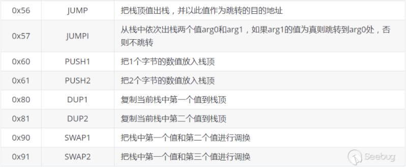

### Solidity合约操作消耗Gas计算公式

固有的gas消耗g~0~ ，即交易执行前支付的gas数量：


其中，Ti，Td 是交易附带的关联数据的字节序列和 EVM 初始化代码的字节序列，具体取决于交易是合约创建还是 消息调用。如果这个交易是合约创建，则会增加 Gtxcreate， 否则不增加。

减少50%的交易input，额外增加一次（2次或多次，视input数据个数来定）读取Map的操作。

Map映射应该存储在永久存储中，所以读取Map涉及到的主要操作是sload. 

EVM一次读取32字节数据，如果Map中的键值对不是用32字节空间存储，那么读取Map还将涉及分割数据的操作。

| 操作               | Gas | 含义                                                              |
|:----------------:|:---:|:---------------------------------------------------------------:|
| G~txdatazero~    | 4   | Paid for every zero byte of data or code for a transaction      |
| G~txdatanonzero~ | 68  | Paid for every non-zero byte of data or code for a transaction. |
| G~sload~         | 200 | Paid for a SLOAD operation                                      |

G~sload~ 在以太坊黄皮书中记录的是200，但是在remix中调试时，G~sload~ 是800。可能以太坊更新到了800，但是还没有更新黄皮书。

##### 编写智能合约test1.sol.

```solidity
// SPDX-License-Identifier: GPL-3.0
pragma solidity ^0.7.0;

contract Test {
    mapping(uint8 => uint8) public map;

    function add(uint8 k) public {
        map[k] = k + 1;
        return;
    }

    function get(uint8 k) public view returns (uint8) {
        uint8 v = map[k];
        return v;
    }
}
```

在remix上进行调试，发现单执行  `get()函数中uint8 v = map[k]`这一操作，消耗Gas为937，其中sload消耗800. 这里的读取涉及到数据分割。

##### 编写智能合约test2.sol.

```solidity
// SPDX-License-Identifier: GPL-3.0
pragma solidity ^0.7.0;

contract Test {
    mapping(uint256 => uint256) public map;

    function add(uint256 k) public {
        map[k] = k + 1;
        return;
    }

    function get(uint256 k) public view returns (uint256) {
        uint256 v = map[k];
        return v;
    }
}
```

在remix上进行调试，发现单执行  `get()函数中uint256 v = map[k]`这一操作，消耗Gas为889，其中sload消耗800. 这里的读取没有涉及到数据分割。

##### 合约执行常用的汇编操作如下。



